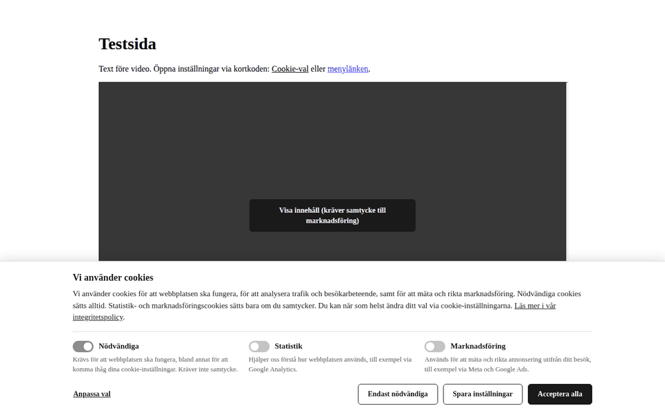
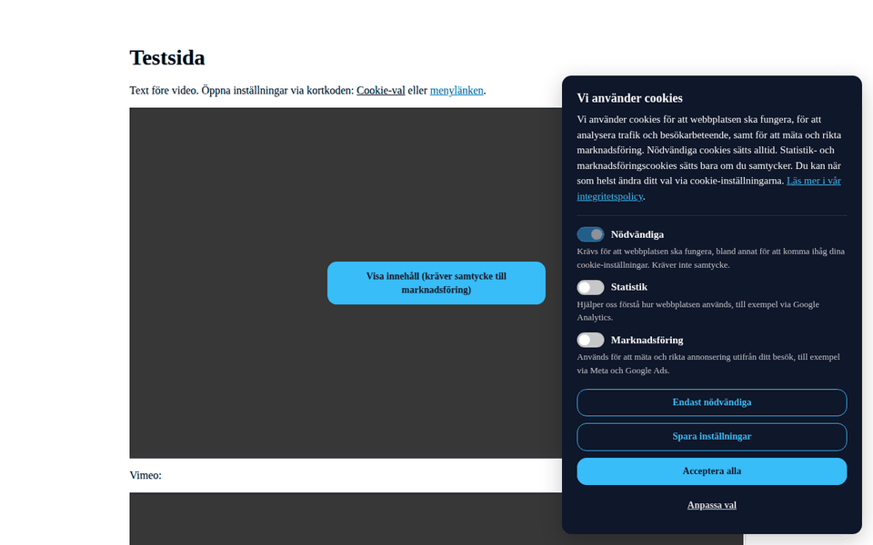
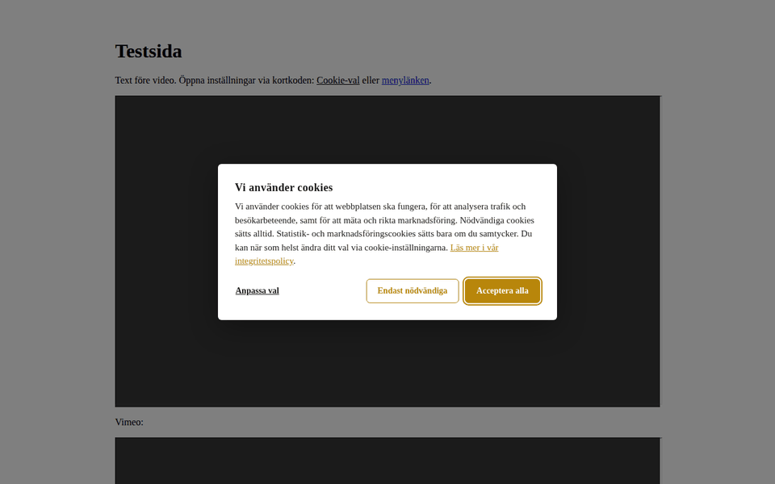

# Relativt Cookie Consent

Lättviktigt WordPress-plugin för GDPR-anpassat cookie-samtycke. Blockerar spårningsskript och videoinbäddningar tills besökaren sagt ja, utan externa tjänster, jQuery eller månadsavgift.

Byggt av [Relativt](https://relativt.se) för våra kundsajter. Fritt att använda under GPL v2 eller senare.

## Vad pluginet gör

- Visar en cookie-ruta med tre kategorier: **Nödvändiga**, **Statistik** och **Marknadsföring**. Besökaren kan acceptera alla, bara nödvändiga eller välja per kategori.
- Skriver ut spårningsskript som `<script type="text/plain" data-cookiecategory="...">`. De körs inte förrän besökaren samtyckt till rätt kategori, och de finns kvar i sidan så att ingen omladdning behövs.
- Har färdiga fält för Google Analytics 4, Google Ads, Google Tag Manager, Google Search Console-verifiering, Meta Pixel, Hotjar, Microsoft Clarity, Microsoft/Bing UET, LinkedIn Insight Tag, Reddit, TikTok, Pinterest och Snapchat. Andra verktyg klistras in under "Egen kod" per kategori.
- Skickar Google Consent Mode v2-signaler (`denied` som utgångsläge, `update` vid val) och ett dataLayer-event för GTM-triggers.
- Blockerar YouTube- och Vimeo-iframes sajtbrett, även i sidbyggare som Oxygen, Elementor och Bricks, genom att skriva om sidans HTML innan den skickas till besökaren. En "Visa innehåll"-knapp ersätter videon tills rätt samtycke finns.
- Låter varje sajt styra utseendet (layout, färger, radie, typsnitt, egen CSS) och alla texter från WP-admin.
- Loggar varje samtycke i en egen tabell (samtyckes-ID, tidpunkt, kategorier, land, version) som bevis enligt GDPR art. 7.1, med sökning, filter och CSV-export under Inställningar → Samtyckeslogg. Poster gallras automatiskt.
- Har en samtyckesversion: höj siffran när ni lägger till verktyg eller ändrar texter, så får alla besökare rutan på nytt.
- Kan vara källa för inställningar och logg åt en headless-frontend på en annan domän via `GET /wp-json/rcc/v1/config` (se [Headless](#headless-egen-ruta-på-en-annan-domän)).
- Hämtar nya versioner från det här repots GitHub Releases och visar dem under Uppdateringar i WP-admin.

## Så ser det ut

Tre layouter, alla med färger och radie från Utseende-fliken. Typsnittet ärvs från temat.

| Rad i full bredd (standard) | Kort i hörnet | Centrerad ruta |
| --- | --- | --- |
|  |  |  |

## Installation på en kundsajt

1. Ladda ner `relativt-cookie-consent.zip` från senaste [releasen](../../releases/latest).
2. I WP-admin: Tillägg → Lägg till nytt → Ladda upp tillägg. Aktivera.
3. Gå till Inställningar → Cookie Consent och fyll i:
   - **Verktyg**: ID:n för de verktyg sajten faktiskt använder. Tomma fält skrivs aldrig ut.
   - **Video & egen kod**: om video ska blockeras och vilken kategori YouTube/Vimeo tillhör, plus egen kod för verktyg utan eget fält.
   - **Texter**: rubrik, ingress, kategoribeskrivningar och knapptexter. Här byter du språk på hela rutan om sajten är på engelska.
   - **Utseende**: layout, färger och typsnitt så rutan passar sajtens profil.
   - **Allmänt**: länk till integritetspolicyn, hur länge samtycket sparas, flytande knapp.
4. Kontrollera sajten i ett inkognitofönster: inga anrop till Google, Meta osv. ska göras innan du klickat i rutan. Verktyget "Nätverk" i webbläsarens utvecklarverktyg visar det tydligt.

Installera från release-zippen, inte från "Download ZIP" på repots startsida. Den senare packar upp till en mapp med fel namn, vilket ställer till det för uppdateringarna.

### Byta från en annan cookie-lösning

Avaktivera den gamla lösningen i samma veva som den här aktiveras, så att besökarna inte får två rutor. Samtyckescookien heter `relativt_cookie_consent`, så besökare som samtyckt i det gamla verktyget får frågan en gång till. Behöver en sajt behålla ett tidigare cookienamn går det via filtret:

```php
add_filter( 'rcc_cookie_name', fn() => 'gammalt_cookienamn' );
```

## Kategorier och vad som blockeras

| Verktyg | Kategori | Notering |
| --- | --- | --- |
| Google Analytics 4 | Statistik (eller Marknadsföring) | Kryssa i "Behandla som marknadsföring" om GA4 är kopplat mot Google Ads-remarketing eller Google Signals. |
| Google Ads | Marknadsföring | |
| Google Tag Manager | Statistik eller Marknadsföring | Se avsnittet om GTM nedan. |
| Google Search Console | Blockeras inte | Ren ägarskaps-verifiering, sätter inga cookies. |
| Meta Pixel | Marknadsföring | |
| Hotjar, Microsoft Clarity | Statistik | |
| Microsoft/Bing UET, LinkedIn, Reddit, TikTok, Pinterest, Snapchat | Marknadsföring | |
| YouTube, Vimeo | Valbart, standard Marknadsföring | |
| Egen kod | Valbart per fält | Kräver behörigheten `unfiltered_html` för att spara `<script>`-taggar. |

## Google Tag Manager

Två lägen under Verktyg:

**Blockerad tills samtycke (standard).** Containern laddas först när besökaren samtyckt till statistik eller marknadsföring. Säkrast om ni inte hanterar samtycke inne i GTM. Taggarna i containern bör ändå ha samtyckeskontroller inställda, så att en marknadsföringstagg inte körs för en besökare som bara godkänt statistik.

**Alltid, med Consent Mode v2.** Containern laddas direkt. Pluginet skickar `gtag('consent', 'default', ...)` med allt nekat innan GTM laddas och `gtag('consent', 'update', ...)` när besökaren väljer. Dessutom pushas eventet `rcc_consent_update` till dataLayer med variablerna `rcc_statistics` och `rcc_marketing` (true/false), som ni kan använda som trigger. I det här läget måste varje tagg i GTM ha "Ytterligare samtycke krävs" eller inbyggda samtyckeskontroller, annars sätter de cookies utan samtycke.

## Samtyckeslogg och samtyckesversion

Varje val besökaren gör skickas till `POST /wp-json/rcc/v1/consent` och sparas i tabellen `{prefix}rcc_consent_log`. Raden innehåller ett slumpat samtyckes-ID (ligger i cookien och visas för besökaren under kategorierna i cookie-inställningarna), tidpunkt (UTC), status (accepterat/avvisat/delvis), valda kategorier, land, samtyckesversion, plugin-version och webbläsarsträng. IP-adress sparas bara som saltad hash och bara om inställningen är påslagen.

Vid en förfrågan från en besökare: be om samtyckes-ID:t, sök på det under Inställningar → Samtyckeslogg, och exportera vid behov som CSV. Poster äldre än inställd gallringstid (standard 12 månader) raderas av ett dagligt cron-jobb; "Gallra nu" kör samma sak direkt.

**Samtyckesversion** (Allmänt-fliken) är ett heltal som sparas i cookien. Höj det med ett när sajten får ett nytt verktyg eller när texterna i rutan ändras – besökare med äldre version får rutan igen, och tidigare samtycken slutar gälla tills de tagit ställning på nytt. ID:t behålls så att loggen visar hela historiken. Cookies från version 1.0.0 saknar versionsnummer och räknas som version 1.

## Länkar till cookie-inställningarna

Besökaren ska kunna ändra sitt val när som helst. Tre sätt:

- Den flytande knappen (på/av och position under Allmänt).
- Kortkoden `[relativt_cookie_settings text="Cookie-inställningar" class="min-klass"]`, t.ex. i footern eller på integritetspolicysidan.
- Attributet `data-rcc-open` på valfritt element, t.ex. en menylänk: `<a href="#" data-rcc-open>Cookie-inställningar</a>`.

## Headless: egen ruta på en annan domän

I ett headless-upplägg ligger frontend på en annan domän än WordPress. Cookien som pluginet sätter syns inte där, och pluginets HTML och JS laddas aldrig. Pluginet blir då **källa för inställningar och texter, och mottagare av samtyckesloggen**. Frontend renderar rutan själv och pratar bara med två endpoints:

| Endpoint | Användning |
| --- | --- |
| `GET /wp-json/rcc/v1/config` | Texter, cookieformat, samtyckesversion, Consent Mode-defaulten, aktiva verktyg med kategori, utseende. Publikt, `Cache-Control: public, max-age=300`. |
| `POST /wp-json/rcc/v1/consent` | Samma logg som den inbyggda rutan använder. |

Båda fungerar cross-origin utan extra kod: WordPress speglar `Origin` på `/wp-json/` och svarar på preflight för `Content-Type`.

### Konfigurationen

```bash
curl -s https://example.com/wp-json/rcc/v1/config
```

```json
{
  "plugin_version": "1.2.0",
  "cookie": { "name": "relativt_cookie_consent", "expiry_days": 180 },
  "consent_version": 1,
  "log_endpoint": "https://example.com/wp-json/rcc/v1/consent",
  "consent_mode_defaults": {
    "ad_storage": "denied", "ad_user_data": "denied", "ad_personalization": "denied",
    "analytics_storage": "denied", "functionality_storage": "granted",
    "personalization_storage": "denied", "security_storage": "granted", "wait_for_update": 500
  },
  "texts": {
    "banner_heading": "…", "banner_text": "…",
    "privacy_link_text": "…", "privacy_url": "/integritetspolicy/",
    "necessary_label": "…", "necessary_desc": "…",
    "statistics_label": "…", "statistics_desc": "…",
    "marketing_label": "…", "marketing_desc": "…",
    "btn_accept_all": "…", "btn_reject_all": "…", "btn_customize": "…", "btn_save": "…",
    "floating_button_label": "…", "consent_id_label": "…"
  },
  "vendors": {
    "ga4": { "id": "G-XXXXXXXXXX", "category": "statistics" },
    "gtm": { "id": "GTM-XXXXXXX", "mode": "blocked", "category": "statistics marketing" }
  },
  "gsc_verification": "…",
  "appearance": {
    "layout": "bar", "show_backdrop": false,
    "color_bg": "#ffffff", "color_text": "#1a1a1a", "color_accent": "#1a1a1a",
    "color_button_bg": "#1a1a1a", "color_button_text": "#ffffff",
    "border_radius": 6, "inherit_font": true,
    "show_floating_button": true, "floating_button_position": "left"
  }
}
```

- Standardvärdena ingår, så svaret är komplett även om ingen sparat inställningarna.
- `vendors` innehåller bara verktyg med ifyllt ID, och är `{}` när inget är ifyllt. Möjliga nycklar: `ga4`, `google_ads`, `gtm`, `meta_pixel`, `hotjar`, `clarity`, `bing_uet`, `linkedin`, `reddit`, `tiktok`, `pinterest`, `snapchat`. Kategorin är exakt den som pluginet själv blockerar verktyget under (GA4 blir `marketing` när "Behandla som marknadsföring" är ikryssat). `"statistics marketing"` betyder att endera kategorin räcker. GTM har även `mode`: `blocked` = vänta på samtycke, `always` = ladda direkt och låt Consent Mode styra taggarna (se avsnittet om GTM ovan).
- `log_endpoint` är tom sträng när loggen är avstängd. Skicka då ingenting.
- `consent_mode_defaults` går genom filtret `rcc_consent_mode_defaults`, så sajtens anpassning följer med.
- Texterna är ren text. Rendera dem som text, inte som HTML.
- Svaret påverkas inte av `?lang` eller liknande: pluginet har ett språk per sajt.

**Vad som inte ingår, och varför.** `custom_code_statistics`, `custom_code_marketing` och `custom_css` lämnas aldrig ut. Egen kod är rå HTML med `<script>`-taggar som en frontend inte kan köra säkert, och den egna CSS:en är skriven för pluginets markup, inte för frontendens. Verktyg som ligger i egen kod får byggas in i frontend direkt, gatade på samma sätt som verktygen i `vendors`. Inget annat i inställningarna är hemligt, men svaret byggs ändå från en uttrycklig lista över fält, så att ett fält som läggs till i inställningarna i framtiden inte följer med av sig självt. Behöver en sajt fler eller färre fält används filtret `rcc_rest_config`:

```php
add_filter( 'rcc_rest_config', function ( $config, $settings ) {
	$config['texts']['video_overlay_text'] = $settings['video_overlay_text'];
	return $config;
}, 10, 2 );
```

`log_endpoint` byggs från WordPress-adressen (`home_url`), precis som för den inbyggda rutan. Pekar "Webbplatsens adress" i WP-admin på frontendens domän, så pekar också `log_endpoint` dit. Sätt då adressen till WordPress-domänen med samma filter.

### Kontraktet för frontend

1. **Hämta konfigurationen** vid bygget eller med kort cache (svaret får cachas i fem minuter). Rendera rutan i egen design med `texts`. Länka `privacy_url` med `privacy_link_text`. En relativ `privacy_url` gäller frontendens domän.
2. **Cookien** sätts på frontendens domän, med samma namn och format som pluginets JS: JSON `{ necessary: true, statistics, marketing, id, version, timestamp }`, URL-kodad med `encodeURIComponent`, `path=/`, `SameSite=Lax`, `Secure` på https och `expires` om `cookie.expiry_days` dagar. `id` genereras av frontend: 20 tecken ur `ABCDEFGHJKLMNPQRSTUVWXYZabcdefghjkmnpqrstuvwxyz23456789`, med `crypto.getRandomValues`. ID:t behålls när besökaren ändrar sitt val, även efter en versionshöjning. `version` är `consent_version` ur konfigurationen och `timestamp` är ISO 8601 (`new Date().toISOString()`).
3. **Versionen avgör om samtycket gäller.** Saknas cookien, eller är dess `version` en annan än konfigurationens `consent_version`, visas rutan och inga verktyg laddas. En cookie utan `version` räknas som version 1, som i pluginet.
4. **Consent Mode v2.** Kör `gtag('consent', 'default', consent_mode_defaults)` innan något Google-skript laddas. När besökaren väljer (och vid sidladdning när ett giltigt samtycke redan finns) kör du `gtag('consent', 'update', …)` med samma mappning som pluginet:

   | Consent Mode | Följer |
   | --- | --- |
   | `analytics_storage` | `statistics` |
   | `ad_storage`, `ad_user_data`, `ad_personalization`, `personalization_storage` | `marketing` |

   Pusha också `{ event: 'rcc_consent_update', rcc_statistics, rcc_marketing }` till `dataLayer`, så att GTM-triggers fungerar som på en vanlig sajt.
5. **Verktygen** laddas först när rätt kategori är godkänd, utifrån `vendors`. GA4 laddas som pluginet gör det: `https://www.googletagmanager.com/gtag/js?id=<id>` (async), följt av `gtag('js', new Date())` och `gtag('config', '<id>', { anonymize_ip: true })`. Frontend behöver inte stödja alla verktyg; de som inte implementeras ignoreras.
6. **Google Search Console.** `gsc_verification` är ren ägarverifiering utan cookies och läggs alltid in som `<meta name="google-site-verification" content="…">` i `<head>`, oavsett samtycke.
7. **Logga valet.** Skicka `POST log_endpoint` med `{ id, statistics, marketing, version }` vid varje val, med `credentials: 'omit'` och `keepalive: true`. Anropet får aldrig blockera rutan, och ett fel ska sväljas. Loggen sparar land från CDN-headers och, om det är påslaget, en saltad hash av IP-adressen som anropar. När besökarens webbläsare anropar direkt är det besökarens IP. Går anropet via en server-proxy blir både land och hash proxyns, och loggen tappar sitt bevisvärde. Avråd från proxy.
8. **Visa samtyckes-ID och tidpunkt** i inställningsläget, med etiketten `consent_id_label` (tom etikett = visa inte). Då kan besökaren uppge ID:t vid en förfrågan, precis som i pluginets ruta.
9. **Öppna rutan igen.** Frontend ansvarar själv för en länk i footern och på policysidan som öppnar inställningarna. Kortkoden och `data-rcc-open` gäller bara sidor som WordPress renderar.
10. **Ändrade texter eller nya verktyg:** höj `consent_version` i WP-admin. Rutan visas då på nytt hos alla besökare, och frontend behöver bara läsa om konfigurationen.
11. **Gäller inte headless:** video-gating, aktivering av `<script type="text/plain">`, egen kod och den flytande knappen. Utseende-inställningarna följer med i `appearance` för den som vill använda dem, men är frivilliga. Notera att pluginets egen ruta alltid har mörkad bakgrund i layouten `center`.

### Exempel i TypeScript

Ramverksneutralt. Rutans markup och händelser kopplar du in i ditt eget ramverk.

```ts
type Category = 'statistics' | 'marketing';
type VendorKey =
  | 'ga4' | 'google_ads' | 'gtm' | 'meta_pixel' | 'hotjar' | 'clarity'
  | 'bing_uet' | 'linkedin' | 'reddit' | 'tiktok' | 'pinterest' | 'snapchat';
type TextKey =
  | 'banner_heading' | 'banner_text' | 'privacy_link_text' | 'privacy_url'
  | 'necessary_label' | 'necessary_desc' | 'statistics_label' | 'statistics_desc'
  | 'marketing_label' | 'marketing_desc' | 'btn_accept_all' | 'btn_reject_all'
  | 'btn_customize' | 'btn_save' | 'floating_button_label' | 'consent_id_label';

export interface RccConfig {
  plugin_version: string;
  cookie: { name: string; expiry_days: number };
  consent_version: number;
  log_endpoint: string; // '' = loggen är avstängd
  consent_mode_defaults: Record<string, 'granted' | 'denied' | number>;
  texts: Record<TextKey, string>;
  vendors: Partial<Record<VendorKey, {
    id: string;
    category: string; // 'statistics', 'marketing' eller 'statistics marketing'
    mode?: 'blocked' | 'always'; // bara gtm
  }>>;
  gsc_verification: string;
  appearance: {
    layout: 'bar' | 'card-left' | 'card-right' | 'center';
    show_backdrop: boolean;
    color_bg: string; color_text: string; color_accent: string;
    color_button_bg: string; color_button_text: string;
    border_radius: number; inherit_font: boolean;
    show_floating_button: boolean; floating_button_position: 'left' | 'right';
  };
}

export interface RccConsent {
  necessary: true;
  statistics: boolean;
  marketing: boolean;
  id: string;
  version: number;
  timestamp: string;
}

declare global {
  interface Window { dataLayer: unknown[]; gtag?: (...args: unknown[]) => void }
}

const ID_CHARS = 'ABCDEFGHJKLMNPQRSTUVWXYZabcdefghjkmnpqrstuvwxyz23456789';

function generateId(): string {
  const buf = new Uint8Array(20);
  crypto.getRandomValues(buf);
  return Array.from(buf, (b) => ID_CHARS.charAt(b % ID_CHARS.length)).join('');
}

function readCookie(name: string): RccConsent | null {
  const escaped = name.replace(/[.*+?^${}()|[\]\\]/g, '\\$&');
  const match = document.cookie.match(new RegExp('(?:^|; )' + escaped + '=([^;]*)'));
  if (!match) return null;
  try {
    const parsed = JSON.parse(decodeURIComponent(match[1]));
    return parsed && typeof parsed === 'object' ? parsed : null;
  } catch {
    return null;
  }
}

/** Gällande samtycke, eller null om rutan ska visas. */
export function getConsent(config: RccConfig): RccConsent | null {
  const c = readCookie(config.cookie.name);
  if (!c) return null;
  const version = parseInt(String(c.version), 10) || 1; // saknad version = 1
  return version === config.consent_version ? c : null;
}

/** Sparar ett val: cookie, Consent Mode och logg. */
export function setConsent(
  config: RccConfig,
  choice: { statistics: boolean; marketing: boolean },
): RccConsent {
  const previous = readCookie(config.cookie.name); // även inaktuell version: ID:t behålls
  const consent: RccConsent = {
    necessary: true,
    statistics: !!choice.statistics,
    marketing: !!choice.marketing,
    id: previous?.id || generateId(),
    version: config.consent_version,
    timestamp: new Date().toISOString(),
  };
  const expires = new Date(Date.now() + config.cookie.expiry_days * 864e5);
  document.cookie =
    `${config.cookie.name}=${encodeURIComponent(JSON.stringify(consent))}` +
    `;expires=${expires.toUTCString()};path=/;SameSite=Lax` +
    (location.protocol === 'https:' ? ';Secure' : '');

  logConsent(config, consent);
  applyConsent(consent);
  return consent;
}

/** Rapporterar valet till samtyckesloggen. Blockerar aldrig. */
export function logConsent(config: RccConfig, consent: RccConsent): void {
  if (!config.log_endpoint) return;
  fetch(config.log_endpoint, {
    method: 'POST',
    credentials: 'omit',
    keepalive: true,
    headers: { 'Content-Type': 'application/json' },
    body: JSON.stringify({
      id: consent.id,
      statistics: consent.statistics,
      marketing: consent.marketing,
      version: consent.version,
    }),
  }).catch(() => {});
}

/** Måste köras innan något Google-skript laddas. */
export function initConsentMode(config: RccConfig): void {
  window.dataLayer = window.dataLayer || [];
  // gtag kräver arguments-objektet, inte en array.
  window.gtag = window.gtag || function () { window.dataLayer.push(arguments); };
  window.gtag('consent', 'default', config.consent_mode_defaults);
}

const granted = (yes: boolean) => (yes ? 'granted' : 'denied');

export function applyConsent(consent: RccConsent): void {
  window.gtag?.('consent', 'update', {
    analytics_storage: granted(consent.statistics),
    ad_storage: granted(consent.marketing),
    ad_user_data: granted(consent.marketing),
    ad_personalization: granted(consent.marketing),
    personalization_storage: granted(consent.marketing),
  });
  window.dataLayer = window.dataLayer || [];
  window.dataLayer.push({
    event: 'rcc_consent_update',
    rcc_statistics: consent.statistics,
    rcc_marketing: consent.marketing,
  });
}

/** True om verktygets kategori är godkänd ("statistics marketing" = endera). */
export function isAllowed(category: string, consent: RccConsent | null): boolean {
  return !!consent && category.split(/\s+/).some((c) => consent[c as Category] === true);
}

let ga4Loaded = false;

export function loadGa4(config: RccConfig, consent: RccConsent | null): void {
  const ga4 = config.vendors.ga4;
  if (!ga4 || ga4Loaded || !isAllowed(ga4.category, consent)) return;
  ga4Loaded = true;
  const s = document.createElement('script');
  s.async = true;
  s.src = 'https://www.googletagmanager.com/gtag/js?id=' + encodeURIComponent(ga4.id);
  document.head.appendChild(s);
  window.gtag?.('js', new Date());
  window.gtag?.('config', ga4.id, { anonymize_ip: true });
}

// Användning:
// const config: RccConfig = await fetch('https://example.com/wp-json/rcc/v1/config').then((r) => r.json());
// initConsentMode(config);
// const consent = getConsent(config);
// if (consent) { applyConsent(consent); loadGa4(config, consent); }
// else { /* visa rutan; vid val: loadGa4(config, setConsent(config, { statistics, marketing })) */ }
```

## För utvecklare

### Egna blockerade skript

Allt som skrivs ut som `<script type="text/plain" data-cookiecategory="statistics">` (eller `marketing`, eller `"statistics marketing"` för endera) aktiveras av pluginet. Externa skript anges med `data-cookiesrc` i stället för `src`. Lägg dem i `<head>` via actionen `rcc_gated_scripts`:

```php
add_action( 'rcc_gated_scripts', function ( $settings ) {
	rcc_blocked_script_open( 'statistics', 'data-cookiesrc="https://example.com/stats.js" async' );
	echo '</script>';
} );
```

Block som blandar `<script>` och andra taggar (t.ex. ``) markeras med `data-html-block="1"` och innehåller rå HTML.

### JavaScript-API

```js
window.rcc.getConsent();          // { necessary: true, statistics: false, marketing: true } eller null (även när versionen är inaktuell)
window.rcc.hasConsent( 'marketing' );
window.rcc.getConsentId();        // samtyckes-ID:t från cookien, eller null
window.rcc.openSettings();        // öppnar rutan med kategorivalen
window.rcc.acceptAll();
window.rcc.rejectAll();
window.rcc.save( { statistics: true, marketing: false } );
window.rcc.refreshIframes();      // om ni själva lägger in blockerade iframes efter sidladdning

document.addEventListener( 'rcc_consent_updated', function ( e ) {
	console.log( e.detail ); // samtyckesobjektet
} );
```

### Filter och actions

| Hook | Typ | Användning |
| --- | --- | --- |
| `rcc_default_settings` | filter | Egna standardvärden, t.ex. byråns husfärger, innan admin sparat något. |
| `rcc_settings` | filter | Åsidosätt sparade värden i kod (t.ex. tomt GA-ID på staging). |
| `rcc_cookie_name` | filter | Namnet på samtyckescookien. |
| `rcc_consent_mode_defaults` | filter | Utgångsläget för Consent Mode v2. |
| `rcc_gated_iframe_hosts` | filter | Fler värdar att blockera, t.ex. `'google.com' => 'marketing'` för Google Maps. |
| `rcc_gate_video_on_request` | filter | Returnera false för att hoppa över video-gatingen på en viss förfrågan. |
| `rcc_inline_css` | filter | CSS-variablerna och den egna CSS:en som skrivs ut. |
| `rcc_script_config` | filter | Konfigurationen som skickas till JS (`rccSettings`). |
| `rcc_rest_config` | filter | Svaret från `GET /wp-json/rcc/v1/config` (args: `$config`, `$settings`). |
| `rcc_cookie_icon_svg` | filter | Ikonen på den flytande knappen. |
| `rcc_enable_github_updates` | filter | Returnera false för att stänga av uppdateringskontrollen. |
| `rcc_github_token` | filter | Alternativ till konstanten `RCC_GITHUB_TOKEN`. |
| `rcc_consent_log_enabled` | filter | Returnera false för att stänga av loggningen i kod (t.ex. på staging). |
| `rcc_consent_log_country` | filter | Egen landsuppslagning om servern inte skickar `CF-IPCountry` eller motsvarande. |
| `rcc_consent_log_record` | filter | Ändra raden innan den sparas, eller returnera en tom array för att hoppa över den. |
| `rcc_consent_logged` | action | Körs efter att en rad sparats (rad-ID, raden). |
| `rcc_gated_scripts` | action | Skriv ut egna blockerade skript i `<head>`. |
| `rcc_banner_top`, `rcc_banner_bottom` | action | Egen markup i rutan, t.ex. en logotyp. |

### CSS

Alla klasser har prefixet `.rcc-`: `.rcc-banner`, `.rcc-banner--bar|card-left|card-right|center`, `.rcc-banner__heading`, `.rcc-category`, `.rcc-switch`, `.rcc-btn--primary|outline|text`, `.rcc-reopen`, `.rcc-inline-link`, `.rcc-iframe-overlay`. Färgerna från Utseende-fliken finns som CSS-variabler på `:root`: `--rcc-bg`, `--rcc-text`, `--rcc-accent`, `--rcc-btn-bg`, `--rcc-btn-text`, `--rcc-radius`, `--rcc-font`.

## Uppdateringar via GitHub

Pluginet har `Update URI: https://github.com/relativtwebb/relativt-cookie-consent` i huvudet och hakar in i WordPress vanliga uppdateringskontroll via filtret `update_plugins_github.com`. Kundsajterna frågar GitHub efter senaste releasen (cachas sex timmar), och en ny version dyker upp under Uppdateringar precis som för plugin från wordpress.org. "Visa detaljer" visar release-texten. Länken "Sök efter uppdatering" i plugin-listan tömmer cachen och kontrollerar direkt.

Repot som används står i konstanten `RCC_GITHUB_REPO` i `relativt-cookie-consent.php`. Byter repot ägare eller namn: uppdatera konstanten, `Plugin URI` och `Update URI` i huvudet innan nästa release.

**Privat repo.** Lägg i wp-config.php på kundsajten:

```php
define( 'RCC_GITHUB_TOKEN', 'github_pat_...' );
```

En fine-grained personal access token med läsrättighet till Contents för just det här repot räcker. Utan token fungerar uppdateringar bara om repot är publikt.

## Släppa en ny version

1. Höj versionsnumret på tre ställen: `Version:` i plugin-huvudet, `RCC_VERSION` och `Stable tag:` i `readme.txt`. Lint-workflowet stoppar om de skiljer sig.
2. Skriv en sektion `## [1.2.0] - ÅÅÅÅ-MM-DD` i `CHANGELOG.md`. Texten blir release-text på GitHub och changelog i WP-admin.
3. Committa, tagga och pusha:

   ```bash
   git commit -am "Version 1.2.0"
   git tag v1.2.0
   git push && git push origin v1.2.0
   ```

4. GitHub Actions bygger `relativt-cookie-consent.zip` (utan `.github`, README och liknande) och skapar releasen med zippen som bilaga. Kundsajterna ser uppdateringen inom sex timmar, eller direkt via "Sök efter uppdatering".

Workflowet vägrar bygga om taggen inte matchar versionen i pluginet.

## Att stämma av innan lansering

- **Integritetspolicyn** ska lista de verktyg som faktiskt körs, med kategori och lagringstid. Pluginet skriver inte om policyn.
- **GA4-kategorin**: kopplat mot Google Ads eller Google Signals räknas som marknadsföring.
- **Video-gatingen** är ett bästa-möjliga-skydd. Testa på en sida med inbäddad video. Lazy-laddade iframes som använder `data-src` i stället för `src` fångas inte.
- **Egen kod** som klistras in måste själv respektera kategorin den ligger under.
- **Samtyckets giltighetstid**: standard 180 dagar. IMY rekommenderar att samtycke inhämtas på nytt åtminstone årligen.
- **Samtyckesloggen** är en personuppgiftsbehandling i sig (pseudonymiserad). Nämn den i integritetspolicyn, särskilt om IP-hash är påslagen, och sätt gallringstiden så att den inte är kortare än samtyckets giltighetstid.
- **Land i loggen** kräver att servern eller CDN:et skickar en landsheader (Cloudflare gör det automatiskt). Annars blir kolumnen tom.

## Utveckling

Inga byggsteg, inga beroenden. Klona repot rakt in i `wp-content/plugins/relativt-cookie-consent/` på en lokal WordPress och aktivera.

```bash
git clone https://github.com/relativtwebb/relativt-cookie-consent.git
```

Syntaxkontroll lokalt:

```bash
find . -name '*.php' -print0 | xargs -0 -n1 php -l
for f in assets/js/*.js; do node --check "$f"; done
```

Filstruktur:

```
relativt-cookie-consent.php        Huvudfil: konstanter, aktivering, uppdaterare
uninstall.php                      Städar bort inställningar, loggtabell och cron vid radering
includes/settings.php              Standardvärden, sanering, inställningssidan
includes/vendors.php               Skripten för varje verktyg
includes/frontend.php              Banner, video-gating, kortkod, tillgångar
includes/consent-log.php           Loggtabell, REST-endpoint, gallring (cron)
includes/rest-config.php           REST-endpointet /rcc/v1/config för headless-frontends
includes/admin-consent-log.php     Sidan Samtyckeslogg: lista, filter, CSV-export
includes/class-rcc-github-updater.php  Uppdateringar från GitHub Releases
assets/css/relativt-cookie-consent.css Frontend-styling (CSS-variabler)
assets/js/relativt-cookie-consent.js   Frontend-logik och JS-API
assets/css/admin.css, assets/js/admin.js  Inställningssidan
```

## Licens

GPL v2 eller senare. Se [LICENSE](LICENSE).
